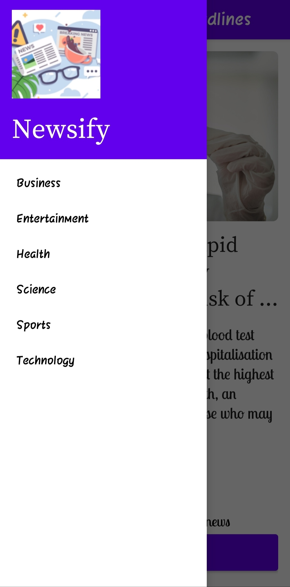

# Newsify-App

Hello everyone ✨,

I made an android application which I named as 'Newsify'. It is a news app which can show news from different categories like business, sports, top headlines etc. I have learnt and implemented many concepts in building this application like:-

1. API call using Retrofit
2. Sharing the contents with Intents
3. Implementation of the Splash screen
4. Side Navigation drawer

Here are the glimpse of the UI of the app:-

<h4>Splash Screen</h4>

  

<h4>Home Screen showing the top headlines</h4>

  

<h4>Sharing the news using other apps</h4>

  

<h4>Side Navigation Drawer</h4>

  

<h4>Differrent News Category</h4>

  

